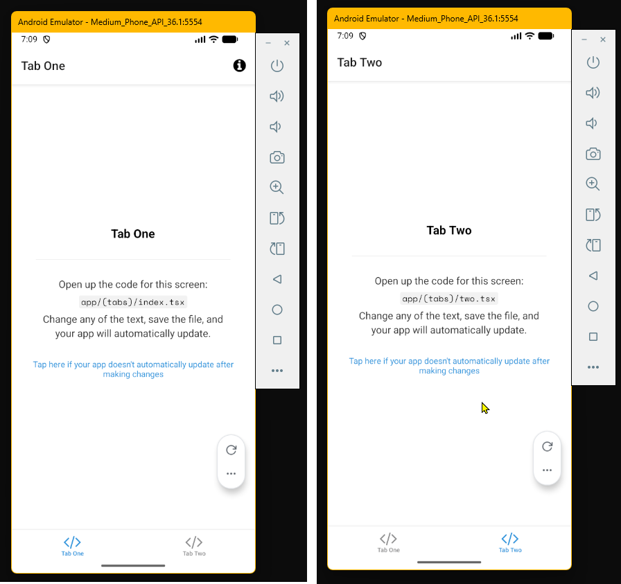
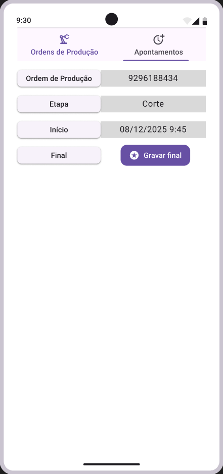

# Sobre esse repositório

O conteúdo presente nesse repositório foi desenvolvido como parte do **Trabalho Prático da disciplina de Arquitetura de Aplicações Móveis**, ministrada pelo professor Fernando Pereira e parte do curso de Especialização em Arquitetura de Software Distribuído, PUC Minas.

A aplicação que será desenvolvida visa simular um processo de rastreamento de ordens de produção em um processo industrial para permitir a correta alocação de custos e planejamento da produção.

##  Requisitos mínimos para a aplicação


### 📱 Funcionalidades Implementadas

#### 🔐 1. Tela de Login
- E-mail e senha
- Botão “Entrar”
- Link para cadastro

#### 📝 2. Cadastro de Usuário
- Nome completo
- E-mail (validação)
- Senha
- Tipo de usuário (cliente/admin)

#### 🏪 3. Cadastro Principal (conforme tema)
Exemplo caso o tema seja restaurante:
- Nome do (Estabelecimento, Seguimento “Enfim algum modelo de cadastro que venha conter os campos abaixo”)
- Endereço completo (Rua, Número, CEP, Bairro, Cidade, UF)
- Latitude e Longitude
- CNPJ com máscara

#### 🍽️ 4. Cadastro de Item (produto/prato/item do tema)
- Nome
- Descrição
- Preço
- Imagem

#### 📋 5. Listagem
- Lista vertical com imagem à esquerda
- Nome em negrito
- Descrição abaixo
- Preço ou informação à direita
- Opções de editar e excluir

---

### 🛠️ Tecnologias Utilizadas

- [React Native](https://reactnative.dev/)
- [Expo](https://expo.dev/)
- [TypeScript](https://www.typescriptlang.org/) (opcional)
- [AsyncStorage](https://react-native-async-storage.github.io/async-storage/) (para persistência local)

### 🎥 Demonstração em Vídeo (em construção)

📺 Assista ao vídeo de apresentação do app pelo link abaixo:

🔗 [Link para o vídeo no YouTube](https://youtube.com/seu-video-aqui)
*(ou adicione o arquivo de vídeo na pasta do projeto)*

### 🔗 Repositório (em construção)

Este repositório contém todo o código-fonte do projeto, bem como os recursos visuais utilizados e instruções para execução local.

---

**Aluno:** Dickson Souza

**Curso:** Arquitetura de Software Distribuído

**Professor:** Fernando Pereira

**Entrega Individual - Trabalho Prático: App Mobile - TEMA LIVRE**

# Etapas do desenvolvimento, comandos e configurações

## Criação do projeto template

A aplicação móvel será desenvolvida em [React Native](https://reactnative.dev/) usando o [framework Expo](https://docs.expo.dev/) para auxiliar no desenvolvimento e testes e, potencialmente, na publicação da aplicação em alguma loja de aplicativos. Ao longo dessa e das próximas seções, serão apresentados os ferramentais e bibliotecas utilizadas na construção da aplicação mas não será o intuito explicar em detalhes como configurar o computador de forma completa para reproduzir esse projeto. Caso alguma informação esteja em falta, registre uma `issue` no repositório que avaliarei a inclusão e/ou correção de informações importantes.

- Versão do Node e do npm (consulte o site oficial do node para obter a versão LTS em um momento futuro - [Download Node.js](https://nodejs.org/en/download)):

```bash
node -v
# v24.11.1

npm -v
# 11.6.2
```

- Criação do projeto Expo template

Será criada uma pasta chamada `mobile_app` para organização dos arquivos.

```bash
mkdir mobile_app
cd mobile_app
npx create-expo-app@latest --template # Essa instalação leva alguns minutos para finalizar, visto que todos os pacotes para o template escolhido - no caso atual, Navigation (TypeScript), são congigurados e instalados, equivalente à uma operação de `npm install`
```

- Para rodar a aplicação em modo de desenvolvimento, execute os comandos abaixo (a partir da raiz do repositório):

```bash
cd mobile_app
cd production_tracker
npm run android
# npm run web para abrir o projeto em um navegador
```

A imagem a seguir mostra o conteúdo nas duas abas da aplicação de exemplo gerada no comando anterior:




## Criação da API usando C# / .NET 9

Para a API da aplicação, será usado um projeto em ASP.NET MVC dada a minha atual familiaridade com esse ecossistema e facilidade de encontrar exemplos de configuração.

Nesse momento, será feita apenas a criação de uma aplicação template para dar início à criação do esqueleto do conjunto aplicação mobile + backend.

A API pode ser criada tanto usando o Visual Studio Community 2022, que é gratuito para projetos open source e desenvolvedores individuais (veja a documentação oficial para os limites de uso do Visual Studio Community 2022 - [VS Community](https://visualstudio.microsoft.com/vs/community))

- Versão em uso do dotnet:

```bash
dotnet --version
# 9.0.307

dotnet --list-sdks
# 9.0.307 [C:\Program Files\dotnet\sdk]

dotnet new list > dotnet-templates.txt
# O arquivo `dotnet-templates.txt` contém os templates .NET disponíveis
```

- Criação do projeto inicial

```bash
mkdir backend
cd backend
dotnet new webapi --use-controllers --name production_tracker_api
```

- Para rodar a API escrita em C# / .NET (considerando que o ponto de partida é a raiz do repositório):

```bash
cd backend
cd production_tracker_api
dotnet run --launch-profile http & curl http://localhost:5006/weatherforecast & echo # teste da aplicação template, sem modificações
```
# Desenho das telas principais no Figma - versão gratuita

Como suporte para o desenvolvimento e parte dos requisitios do trabalho final, as telas principais do aplicativo em desenvolvimento estão sendo construídas usando o Figma, versão gratuita.

As telas podem ser visualizadas no link a seguir

[Telas do aplicativo Production Tracker no Figma](https://www.figma.com/design/gCrMeJdoBKqljok4UnIfV8/Telas-do-aplicativo?node-id=4-83&t=gnBfXmrL67we41UC-1)

As primeiras duas telas estão prontas e já permitem uma primeira iteração no desenvolvimento da aplicação React Native:

<div style="display:flex;">
    <div style="display:box;width:30%">
        <a href="./docs/images/01_primeira_tela_Figma.png" width="30%" style="display:block"/>
            Tela 1: Visualização das ordens de produção
        </a>
        <br/><br/><br/>
        
    </div>
    <div style="display:box;width:30%">
        <a href="./docs/images/02_segunda_tela_Figma.png" width="30%" style="display:block"/>
            Tela 2: Criação de um apontamento de horas para uma etapa de uma ordem de produção
        </a>
        <br/><br/>
        
    </div>
</div>